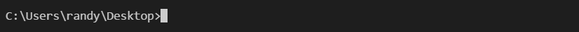
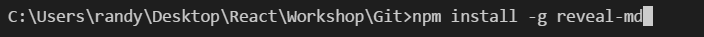
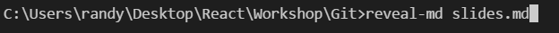

# Coding Cougs Git Workshop

Requires the following

* Text Editor (VSCode)
* Knowledge in Shell Commands
* NodeJS
* reveal-md


Install NodeJs

* Download Node Version 6: https://nodejs.org/en/download/
* Install it on to system

Repository

* Download Zip into a folder


Shell Commands

* Open a terminal (Preferably within VSCode)


* Change Directory into new folder


Install reveal-md and launch the presentation
```
npm install -g reveal-md
```



```
reveal-md slides.md
```


